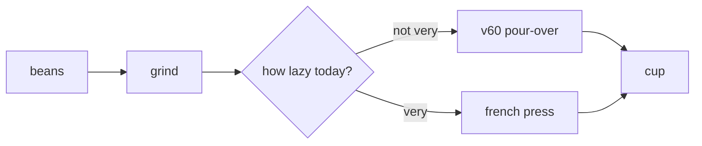
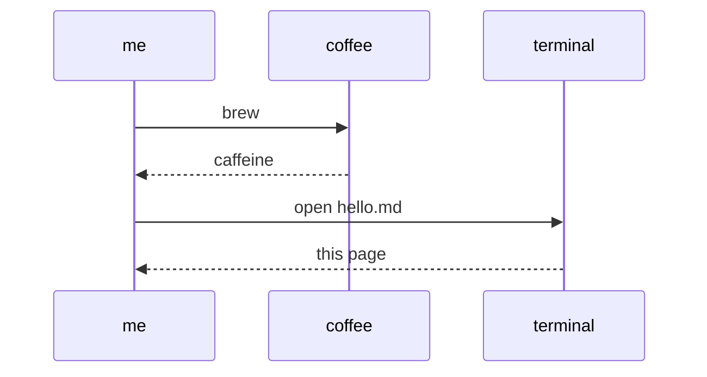

# charts — what this page can render

The in-page viewer renders GFM markdown: mermaid diagrams, KaTeX math,
and syntax-highlighted code. Demoed below with less important things.

## Pour-over decision tree (mermaid flowchart)



## A morning, formally specified (mermaid sequence)



## Math (KaTeX)

Euler's identity, still undefeated:

$$e^{i\pi} + 1 = 0$$

Inline too: a terminal of $\text{cols} \times \text{rows}$, the gaussian
integral $\int_{-\infty}^{\infty} e^{-x^2}\,dx = \sqrt{\pi}$.

## Code

```python
def fib(n: int) -> int:
    a, b = 0, 1
    for _ in range(n):
        a, b = b, a + b
    return a
```

> Placeholder copy — the layout is final, the words are negotiable.
