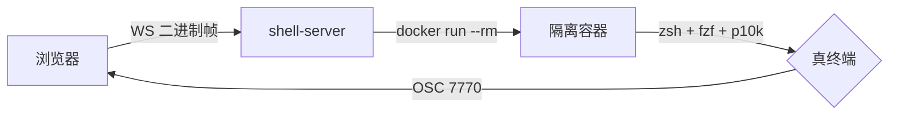
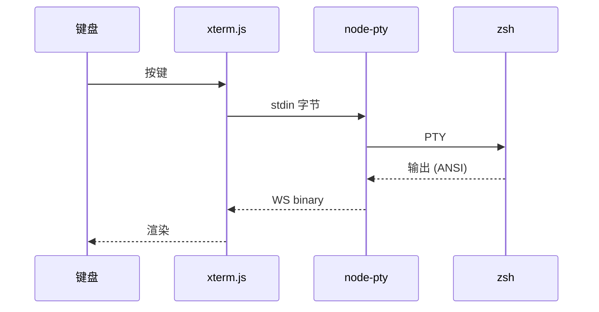

# charts — markdown 渲染能力展示 (mermaid + KaTeX)

## 流程图 (mermaid)



## 时序图 (mermaid)



## 数学 (KaTeX)

欧拉恒等式:

$$e^{i\pi} + 1 = 0$$

行内公式: 终端尺寸 $\text{cols} \times \text{rows}$, 高斯积分 $\int_{-\infty}^{\infty} e^{-x^2}\,dx = \sqrt{\pi}$。

## 代码块

```python
def fib(n: int) -> int:
    a, b = 0, 1
    for _ in range(n):
        a, b = b, a + b
    return a
```

> 占位素材 — 结构已就绪，内容待替换。
